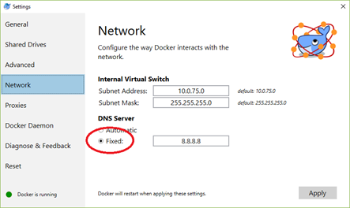
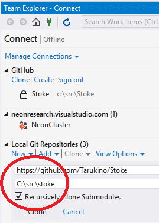
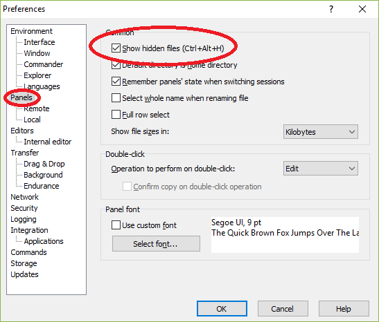

# neonFORGE
The neonFORGE, LLC technology stack.
## Workstation Requirements
* Windows 10 Professional (64-bit) with at least 16GB RAM
* Visual Studio Community Edition

Note that the build environment currently assumes that only one Windows user will be acting as a developer on any given workstation.  Developers cannot share a computer.
## Workstation Configuration

Follow the steps below to configure a development or test workstation:

1. Make sure that Windows is **fully updated**.

2. I highly recommend that you configure Windows to display hidden files:

  * Press the **Windows key** and run **File Explorer**
  * Click the **View** tab at the top.
  * Click the **Options** icon on the right and select **Change folder and search options**.
  * Click the **View** tab in the popup dialog.
  * Select the **Show hidden files, folders, and drives** radio button.
  * Uncheck the **Hide extensions for known types** check box.

3. Some versions of Skype listen for inbound connections on ports **80** and **443**.  This will interfere with services we'll want to test locally.  You need to disable this:

  * In Skype, select the **Tools/Options** menu.
  * Select the **Advanced/Connection** tab on the left.
  * **Uncheck**: Use **port 80 and 443** for additional incoming connections.
  
    
  * **Restart Skype**

4. Ensure that hardware virtualization is enabled in your BIOS.

5. Install the latest **32-bit** production release of PowerShell Core from: [here](https://github.com/PowerShell/PowerShell/releases) (`PowerShell-#.#.#-win.x86.msi`)

6. Enable PowerShell script execution via (in a CMD window as administrator):

  `powershell Set-ExecutionPolicy -ExecutionPolicy Unrestricted -Scope CurrentUser`

7. Install **Visual Studio Community Edition 15.8+** from [here](https://www.visualstudio.com/downloads/).

  * Select **all workloads** on the first panel
  * Select **individual components** and enable these:
    * **.NET:** All SDKs, Targeting Packs, and Advanced ASP.NET Features
    * **Code Tools:**
    * Git for Windows
    * GitHub extensions for Visual Studio
    * Help Viewer
  * Click **Install** (and take a coffee break)
  * Install **.NET Core SDK 2.1.403 from [here](https://www.microsoft.com/net/download/thank-you/dotnet-sdk-2.1.403-windows-x64-installer)
  * Apply any pending **Visual Studio updates**
  * **Close** Visual Studio and install any updates
  
8. Create a **shortcut** for Visual Studio and configure it to run as **administrator**.  To build and run neonFORGE applications and services, **Visual Studio must be running with elevated privileges**.

9. Install **Docker for Windows** from [here](https://store.docker.com/editions/community/docker-ce-desktop-windows)

  * Use the **Stable** channel unless you have a specific need for bleeding edge features
  * **Right-click** the Docker icon in the system tray and select **Settings...*

    
  * Select the **Shared Drives** tab and **share** the drive where you'll clone the project source code (typically drive C:)
  * You'll need to enter your workstation **credentials**
  * Select the **Daemon** tab on the left and make sure that **Experimental** is **unchecked**

10. Test your Docker configuration.

  * Open a **CMD** command window.
  * Run this command: `docker pull alpine`

11. If the previous step failed with a **Network Timeout** or another error, you'll need to update Docker's network settings:

  * **Right-click** the Docker again in the system tray and select **Settings...*
  * Click **Network** on the left, select Fixed DNS Server and then **Apply**

    

12. **Clone** the source repository on your workstation:

  * Create an individual Github account [here](https://github.com/join?source=header-home) if you don't already have one
  * Have one of the neonFORGE repository administrators **grant you access** to the repository
  * Go to [GitHub](http://github.com) and log into your account
  * Go to the neonFORGE [repository](https://github.com/jefflill/neonFORGE).
  * Click the *green* **Clone or download** button and select **Open in Visual Studio**
  * A *Launch Application* dialog will appear.  Select **Microsoft Visual Studio Protocol Handler Selector** and click **Open Link**
  * Choose or enter the directory where the repository will be cloned.  This defaults to a user-specific folder.  I typically change this to a global folder to keep the file paths short.
  
    
  * Click **Clone**

13. **Close** any running instances of **Visual Studio**

14. Install **7-Zip (32-bit)** (using the Windows *.msi* installer) from: [here](http://www.7-zip.org/download.html)

15. Configure the build **environment variables**:

  * Open **File Explorer**
  * Navigate to the directory holding the cloned repository
  * **Right-click** on **buildenv.cmd** and then **Run as adminstrator**
  * Close the CMD window when the script is finished

16. Restart Visual Studio (to pick up any environment changes).

17. Import the Ansible passwords used for encrypting secret files in the Git repository Import using this command (use the standard neonFORGE **DEVOPS Password** when prompted):

&nbsp;&nbsp;&nbsp;&nbsp;`neon ansible password import %NF_ROOT%\passwords.zip`

18. Confirm that the solution builds:

  * Run **Visual Studio** as **administrator**
  * Open **$/neonFORGE.sln** (where **$** is the repo root directory)
  * Select **Build/Rebuild** Solution

19. Many server components are deployed to Linux, so you’ll need terminal and file management programs.  We’re currently standardizing on **PuTTY** for the terminal and **WinSCP** for file transfer. install both programs to their default directories:

  * Install **WinSCP** from [here](http://winscp.net/eng/download.php) (I typically use the "Explorer" interface)
  * Install **PuTTY** from [here](https://www.chiark.greenend.org.uk/~sgtatham/putty/latest.html)
  * Run **WinSCP* and enable **hidden file display** [WinSCP Hidden Files](/README/WinSCPHiddenFile.png)
  * *Optional*: The default PuTTY color scheme sucks (dark blue on a black background doesn’t work for me).  You can update the default scheme to Zenburn Light by **right-clicking** on the `$\External\zenburn-ligh-putty.reg` in **Windows Explorer** and selecting **Merge**
  * WinSCP: Enable **hidden files**.  Start **WinSCP**, select **Tools/Preferences...", and then click **Panels** on the left and check **Show hidden files**:
  
    

20. *Optional*: Install **OpenVPN**

   * Download the Windows Installer from [here](https://openvpn.net/index.php/open-source/downloads.html)
   * Run this command as administrator in a CMD window to install a second TAP interface:

   `"%PROGRAMFILES%\Tap-Windows\bin\addtap.bat"`

21. *Optional*: Install **Fiddler4** from: [here](http://www.telerik.com/download/fiddler)

22. *Optional*: Install **Notepad++** from: [here](https://notepad-plus-plus.org/download)

23. *Optional*: Install **Postman** REST API tool from: [here](https://www.getpostman.com/postman)

24. *Optional*: Download **Cmdr** *Mini* command shell from [here](http://cmder.net/):

  * Unzip it into a new folder and then ensure that this folder is in your **PATH**.
  * Confgure this to run as administrator.
  * Run Cmdr and configure settings.
  * Consider removing the alias definitions in `$\config\user-aliases.cmd` file so that commands like `ls` will work properly.  I deleted all lines beneath the first `@echo off`.

25. *Optional*: Install the latest version of **XCP-ng Center** from [here](https://github.com/xcp-ng/xenadmin/releases) if you'll need to manage Virtual Machines hosted on XCP-ng.

# Git Branches and Docker Image Tagging Conventions

We're going to standardize on some conventions for managing source control branches and published Docker image tags.

## Branches

Four branches in the repo are to be used for specific purposes:

* **master:** Includes the most recent relatively stable commits.  Developers will merge any changes here after confirming that the changes appear to work.  The **master** branch should always build and pass unit tests and will generally act as the candidate for test, staging, and production releases.

* **prod:** Includes commits that will be deployed into production. 

* **stage:** Includes commits that will be deployed info a staging environment.

* **test:** Includes commits that will be deployed into a production environment.

Developers will generally have one or more branches prefixed by their first name (lowercase), e.g. *jeff*, *jeff-experimental*,...  When developers need to colloborate on a feature over an extended period of time, we'll create feature branches like *feature-coolstuff*.  Most development work will happen in a developer or feature branch.

